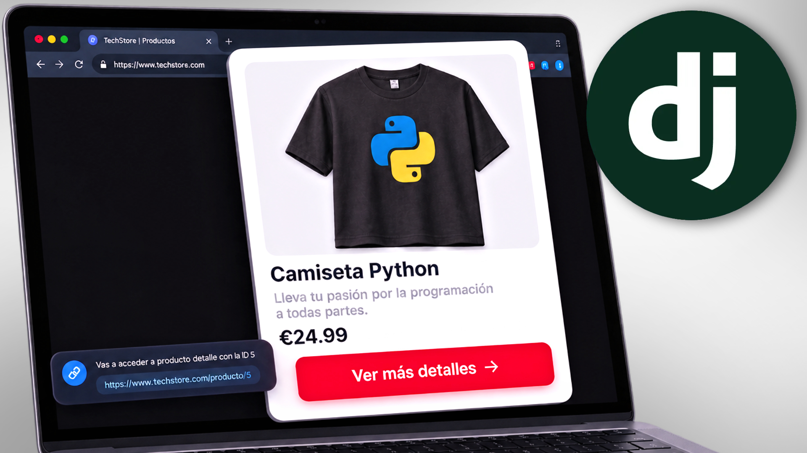
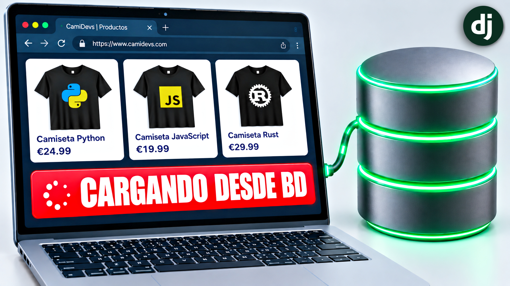
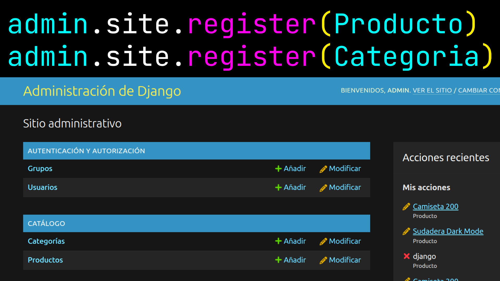
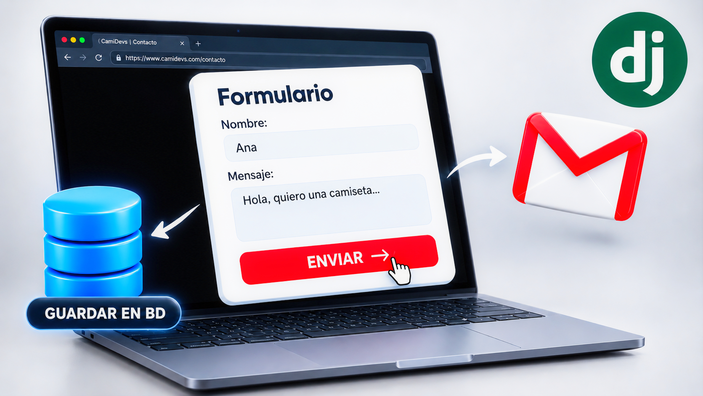

# Aprender Django

Serie de vídeos en la que aprendemos Django construyendo una web real desde cero: **camidevs**.

Este repositorio contiene el código del proyecto. Cada vídeo añade una parte nueva y el código se va actualizando a medida que avanza la serie, así que aquí siempre tendrás la versión más reciente de todo lo que hemos visto.

> Para seguir la serie necesitas saber Python. Si aún no lo dominas, tienes la serie [Aprender Python](https://github.com/Iv4nTech/aprender_python).

---

## Vídeos

### 1 · Crear el proyecto y la primera app

Creamos el proyecto `camidevs` con `django-admin startproject`, vemos para qué sirve cada archivo que genera Django, creamos la app `catalogo` con `startapp` y la registramos en `INSTALLED_APPS`.

▶️ [Ver el vídeo](https://www.youtube.com/watch?v=Ed0S_ueLx0M)

### 2 · URLs, views y templates

Creamos las primeras páginas de `camidevs`: vemos el ciclo URL → view → template, definimos URLs con parámetros, usamos `render()` y `redirect()`, trabajamos con el Django Template Language (variables, filtros, `if` y `for`) y reutilizamos HTML con `` y la herencia de templates. Además, usamos `` con namespace para que las rutas nunca se rompan.

▶️ [Ver el vídeo](https://www.youtube.com/watch?v=Y3YfHACoSHU)

### 3 · Models, migrations y ORM

Creamos la primera base de datos de `camidevs`: definimos los models `Categoria` y `Producto` con sus fields y una `ForeignKey`, generamos y aplicamos migrations con `makemigrations` y `migrate`, vemos el SQL con `sqlmigrate` y usamos el ORM para crear, leer, filtrar y borrar datos. La home y el detalle de producto pasan a leer de la base de datos, con `get_object_or_404` para los productos que no existen.

### 4 · Panel de administración

Activamos el admin de Django: creamos un superusuario, registramos los models, ponemos el proyecto en español con `LANGUAGE_CODE` y `TIME_ZONE` y damos nombres legibles con `verbose_name`. Con `ModelAdmin` personalizamos el listado de productos (columnas, filtros, búsqueda y edición en línea), creamos una acción propia para ocultar productos y cambiamos la cabecera del panel.

### 5 · Formularios

Creamos la página de contacto: definimos un formulario con `Form`, lo procesamos en una view con `is_valid()` y `cleaned_data`, entendemos la protección CSRF y añadimos nuestras propias validaciones con `clean_<campo>()` y `clean()`. Enviamos un email a la consola con `send_mail()`, mostramos un mensaje de confirmación con el framework de mensajes y, por último, lo convertimos en un `ModelForm` que guarda cada consulta en la base de datos.

---

## El proyecto final

camidevs está en construcción. Cuando la serie termine, este repositorio tendrá el proyecto completo, con todo el código que hemos ido escribiendo vídeo a vídeo, para que puedas verlo entero y usarlo como referencia.
