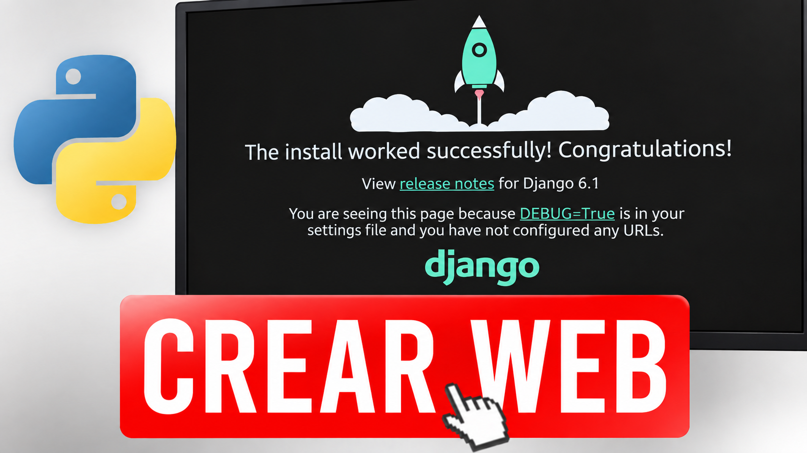

# Aprender Django

Serie de vídeos en la que aprendemos Django construyendo una web real desde cero: **camidevs**.

Este repositorio contiene el código del proyecto. Cada vídeo añade una parte nueva y el código se va actualizando a medida que avanza la serie, así que aquí siempre tendrás la versión más reciente de todo lo que hemos visto.

> Para seguir la serie necesitas saber Python. Si aún no lo dominas, tienes la serie [Aprender Python](https://github.com/Iv4nTech/aprender_python).

---

## Vídeos

### 1 · Crear el proyecto y la primera app

Creamos el proyecto `camidevs` con `django-admin startproject`, vemos para qué sirve cada archivo que genera Django, creamos la app `catalogo` con `startapp` y la registramos en `INSTALLED_APPS`.

▶️ [Ver el vídeo](https://www.youtube.com/watch?v=Ed0S_ueLx0M)

---

## El proyecto final

camidevs está en construcción. Cuando la serie termine, este repositorio tendrá el proyecto completo, con todo el código que hemos ido escribiendo vídeo a vídeo, para que puedas verlo entero y usarlo como referencia.
